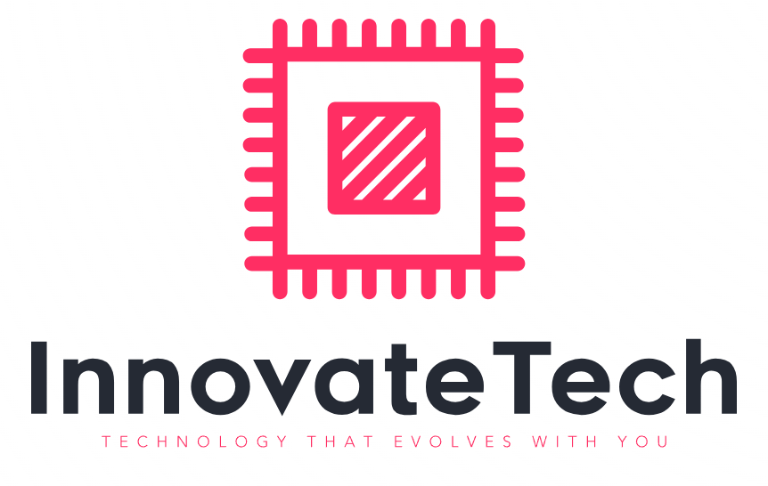
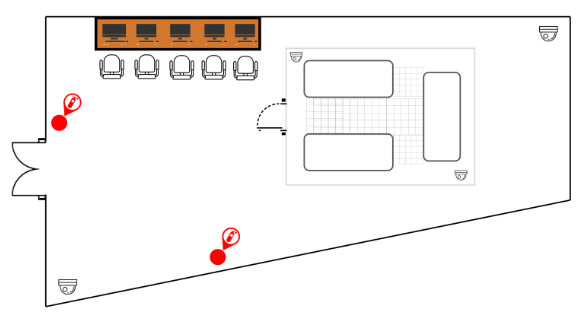
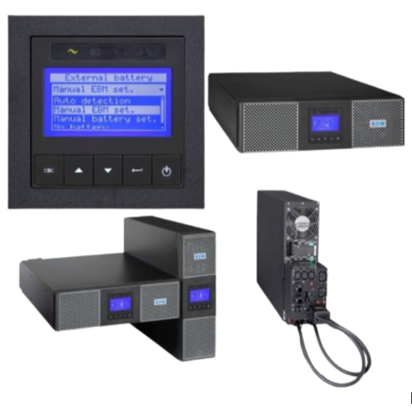
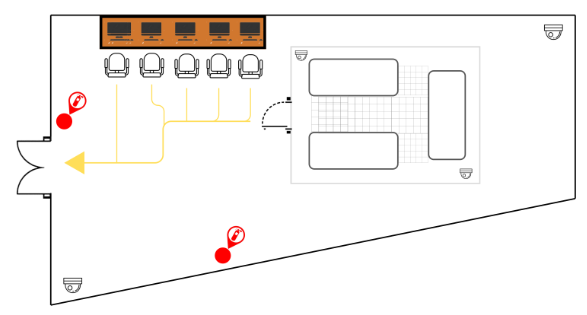

# pro-ASIXc1B-Grup1

Repositorio oficial del proyecto transversal del Grupo 1.

---

## Índice:

- [1. Propuesta de CPD](#1-propuesta-de-cpd)
- [2. Implantación de los servicios de audio y vídeo](#2-implantación-de-los-servicios-de-audio-y-vídeo)
- [3. Diseño e implementación de una base de datos](#3-diseño-e-implementación-de-una-base-de-datos)
- Sostenibilidad (Nota: Este parece un punto general, si es un apartado específico, habría que crearlo y enlazarlo)

Manuales:
-
  - [BBDD](manuales/SMB%20y%20Monitoreo%20%28manual%29.pdf)
  - [Audio y Video](manuales/SMB%20y%20Monitoreo%20%28manual%29.pdf)
  - [SMB y Monitoreo](manuales/SMB%20y%20Monitoreo%20%28manual%29.pdf)
  - [DNS](manuales/SMB%20y%20Monitoreo%20%28manual%29.pdf)
  - [Web](manuales/SMB%20y%20Monitoreo%20%28manual%29.pdf)

---

## 1. Propuesta de CPD

Propuesta para el Centro de Procesamiento de Datos (CPD) de InnovateTech, enfocada en eficiencia, seguridad y sostenibilidad.

### 1.1. Ubicación física

*   **Localización:** **Innovation Dock, Stavanger, Noruega**. Elegida por el clima favorable (refrigeración natural), economía en crecimiento y apoyo a proyectos sostenibles.
    
*   **Climatización:**
    *   Sistema: Suelo técnico para flujo de aire frío exterior, aprovechando el clima local.
    *   Temperatura: 18-23°C, controlada por sensores con alertas.
    *   Humedad: Controlada por el mismo sensor de temperatura.
    *   Limpieza del aire: Sistemas de purificación en conductos.
*   **Identificación de la sala:** Acceso restringido mediante tarjetas individuales por coste, fiabilidad y facilidad de gestión.
*   **Distribución y gestión del cableado:** Topología en estrella desde el rack de comunicaciones. Tipos: UTP Cat6A (LAN), Fibra OM4/SM (interconexión racks), HDMI/DP (monitores), Alimentación. Todo etiquetado.
*   **Suelo y techo técnico:** Diseño para optimizar el flujo de aire (pasillos fríos/calientes), facilitando la refrigeración natural y la extracción de aire caliente.
*   **Estructuración de los racks (mínimo 2, proponemos 3):**
    1.  **Rack Servicios Principales:** DNS, BBDD, WEB, Audio/Vídeo, SMB/Monitorización.
    2.  **Rack Backups:** Soporte para los servicios principales, con réplicas distribuidas.
    3.  **Rack Comunicaciones:** Switches, Routers, Paneles de parcheo para la red local.
    *   Modelo Rack: **APC - AR3100B2 armario rack 42U**.

### 1.2. Infraestructura IT

*   **Servidores:** 9 servidores en total en la sede de Noruega (5 principales, 4 de soporte).
    *   Rack 1: 5 servidores principales (DNS, BBDD, WEB, Audio/Video, SMB/Monitorización).
    *   Rack 2: 4 servidores de soporte.
*   **Especificaciones de los servidores:**

    | Servidor              | CPU             | RAM       | Disco principal                |
    | --------------------- | --------------- | --------- | ------------------------------ |
    | DNS                   | 2-4 núcleos     | 4 GB      | SSD 120 GB                     |
    | BBDD                  | 8 núcleos       | 32-64 GB  | 2x SSD 1TB + 2x SSD 5TB RAID   |
    | WEB                   | 4 núcleos       | 8-16 GB   | SSD 220 GB                     |
    | Audio/Video           | 8 núcleos + GPU | 32 GB     | SSD 1 TB + HDD 2TB             |
    | SMB + Monitorización  | 4 núcleos       | 16 GB     | SSD + RAID de HDDs (2-4 TB)    |
*   **Justificación:** Especificaciones adaptadas a la carga y criticidad de cada servicio (alta disponibilidad para DNS, RAM/IO para BBDD, GPU para vídeo, etc.).
*   **Servidores en el extranjero (CDN):** Réplicas en ubicaciones estratégicas (EE. UU., México, Alemania, etc.) para una Content Delivery Network eficiente.
*   **Soporte en la nube:** Colaboración con marcas globales (ATO, OperaGX, etc. - rol a definir: clientes/partners).
    

### 1.3. Infraestructura eléctrica

*   **SAI (Sistema de Alimentación Ininterrumpida):** Modelo **Eaton 9PX 5000i HotSwap**.
    *   Características clave: Doble conversión en línea, hasta 98% de eficiencia, función HotSwap (mantenimiento sin interrupción), pantalla LCD, gestión remota.
    *   Beneficios: Protección fiable, continuidad del servicio, reducción de costes operativos y huella de carbono.
    

### 1.4. Seguridad física y lógica

*   **Física:**
    *   Control de acceso: Puertas con tarjeta y cortinas laminares.
    *   Videovigilancia: Cámaras estratégicas.
    *   Prevención de incendios: Paredes de lana de roca, detectores de humo, extintores de polvo ABC.
    *   Vías de evacuación: Señalizadas y claras.
    
*   **Lógica:**
    *   Acceso: Autorización por contraseñas robustas y mínimos privilegios.
    *   Firewalls: Perimetrales y a nivel de host si es necesario.
    *   Monitorización: Servidor dedicado (incluye S3 Gateway).
    *   Backups: NAS centralizado para copias de seguridad.
    *   RAIDs: DNS (RAID1), BBDD (RAID10), WEB (RAID1), Audio/Vídeo (RAID5/6), SMB/Monitorización (RAID6/1).
*   **Prevención de riesgos laborales:** Evaluación de riesgos, formación específica (eléctricos, mecánicos, ergonómicos, incendios), señalización clara, EPIs.

### 1.5. Sostenibilidad

Enfoque integral para minimizar el impacto ambiental y maximizar la eficiencia operativa.
*   **Optimización consumo energético:** Equipos de bajo consumo (SAI Eaton 9PX), dimensionamiento adecuado de servidores.
*   **Energía verde:** Análisis para contratar proveedores de energía renovable.
*   **Ahorro en cableado:** Diseño en estrella para minimizar longitud y material.
*   **Refrigeración natural:** Aprovechamiento del clima de Noruega y diseño de la sala (suelo/techo técnico, pasillos fríos/calientes).
*   **Parada selectiva de equipos:** Políticas para modos de bajo consumo o parada en periodos de baja actividad.

### 1.6. Implementación del CPD en la nube AWS (Consideraciones)

Se contempla el uso de servicios cloud, con AWS como principal referente inicial para ciertos servicios o como parte de la estrategia híbrida o de backup.

### 1.7. Comparativa de eficiencia energética con proveedores de nube

Investigación sobre las prácticas de sostenibilidad y eficiencia de los principales proveedores:

*   **AWS:** CPDs propios optimizados, PUE ~1.1, objetivo 100% renovable para 2025 (90% actual). Herramientas como Customer Carbon Footprint.
*   **Microsoft Azure:** IA para optimizar consumo, PUE ~1.125. Objetivo 100% renovable para 2025, carbon negative para 2030. Herramienta: Microsoft Sustainability Calculator.
*   **Google Cloud Platform (GCP):** Pioneros en sostenibilidad, PUE ~1.1. Neutrales en carbono desde 2007, objetivo energía libre de carbono 24/7 para 2030.

**Tabla Comparativa Resumida:**

| Característica                     | AWS                             | Azure                         | Google Cloud                     |
| ---------------------------------- | ------------------------------- | ----------------------------- | -------------------------------- |
| Energía 100% renovable (prevista)  | 2025                            | 2025                          | Ya cumple, + obj. 24/7 (2030)  |
| Emisiones netas de carbono         | 2040 (net-zero)                 | 2030 (carbon negative)        | Desde 2007 (neutral)            |
| PUE Medio                          | ~1.1-1.2                        | ~1.125                        | ~1.1                             |

**Conclusiones:** Los tres tienen fuertes compromisos. GCP destaca en neutralidad de carbono. AWS en infraestructura extensa. Azure en integración corporativa.

**Leyenda:**
*   **PUE (Power Usage Effectiveness):** Métrica de eficiencia energética. Un valor cercano a 1.0 indica mayor eficiencia.

---

## 2. Implantación de los servicios de audio y vídeo

Para la transmisión de audio y vídeo, se implementó una solución en AWS EC2 (Ubuntu Server 22.04 LTS). Esta infraestructura gestiona transmisiones en tiempo real y contenido bajo demanda, con un enfoque en la calidad y la eficiencia de la red.

### 2.1. Infraestructura y Seguridad
Se configuró una instancia `t2.large` con IP pública. La seguridad se gestionó mediante grupos de seguridad de AWS y `ufw` en Ubuntu, abriendo puertos clave: `8000/TCP` (Icecast), `22/TCP` (SSH), `5004/UDP` (RTP) y `5201/TCP-UDP` (iperf3).

### 2.2. Servidor de Audio
Se utilizó **Icecast2** como servidor de streaming y **Darkice** como cliente fuente.
*   **Icecast2:** Configurado en el puerto 8000, con `/etc/icecast2/icecast.xml` ajustado para `hostname`, contraseñas, y punto de montaje (ej. `/live.mp3`). Se habilitó `Access-Control-Allow-Origin`.
*   **Darkice:** Captura audio del sistema (`/etc/darkice.cfg` define calidad y conexión a Icecast2).
*   **Tarjeta de Audio Virtual (`snd-aloop`):** Se instaló `libmp3lame-dev` y se configuró `snd-aloop` para la gestión de audio, crucial para Darkice.
*   **Grabación:** `arecord` para grabar audios, almacenados en `/etc/icecast2/web` y enlazados a `/usr/share/icecast2/web` para acceso bajo demanda. Scripts facilitan la activación de `snd-aloop` y la grabación.

### 2.3. Servidor de Streaming de Vídeo
**FFmpeg** se utilizó para transcodificar y transmitir vídeo a Icecast2.
*   **FFmpeg:** Transforma vídeos locales a WebM (códecs `libvpx` y `libvorbis`) y los envía al servidor Icecast. Ejemplo de comando:
    `ffmpeg -re -i video.mp4 [...] icecast://source:pass@IP:8000/stream.webm`
*   Los usuarios acceden al stream (ej. `http://IP:8000/stream.webm`) vía web. Un script ayuda a seleccionar el vídeo a emitir.

### 2.4. Comprobaciones de Ancho de Banda
Se utilizó **iperf3** para verificar la capacidad de la red.
*   **Funcionamiento:** El servidor escucha (`iperf3 -s`) y el cliente inicia pruebas (`iperf3 -c IP_SERVIDOR`), permitiendo medir el rendimiento TCP/UDP y asegurar que la red soporta los bitrates de los streams.

Esta configuración provee servicios de audio y vídeo robustos, capaces de gestionar el tráfico y garantizar una experiencia de usuario óptima.

---

## 3. Diseño e implementación de una base de datos

El Grupo 1 ha diseñado e implementado una base de datos relacional en **MySQL Server 9.3** para la gestión de personal. Esta se aloja en una instancia **AWS EC2 con Windows Server 2022 Base** y se administra con **MySQL Workbench 8.0 CE**.

### 3.1. Configuración de Infraestructura
Se configuró una instancia EC2 Windows con IP elástica. Un `Security Group` de AWS permite el tráfico entrante a los puertos `3306/TCP` (MySQL) y `3389/TCP` (RDP). Se instalaron MySQL Server y Workbench, configurando el servidor MySQL para inicio automático y definiendo la contraseña de `root`.

### 3.2. Diseño del Esquema
Se creó un schema `InnovateTech` con las tablas:
*   **`Departamento`**: (`codigo_departamento` PK, `nombre`, `telefono`).
*   **`Categoria`**: (`codigo_categoria` PK, `salario_total`, `periodo_prueba`, `dias_vacaciones`).
*   **`Empleados`**: (`dni` PK, `nombre`, `apellidos`, `direccion`, `telefono`, `codigo_departamento` FK, `codigo_categoria` FK).

### 3.3. Modelo Relacional
Las relaciones establecen que un empleado pertenece a un departamento y tiene una categoría. Las claves foráneas en `Empleados` referencian a `Departamento` y `Categoria` con `ON UPDATE CASCADE` y `ON DELETE RESTRICT`. El manual incluye un esquema E-R y el diagrama relacional.

### 3.4. Implementación e Inserción de Datos
Las tablas se crearon vía MySQL Workbench. Se insertaron datos, asegurando que la información de `Categoria` (salario, periodo de prueba, vacaciones) corresponda al convenio "Consultoria, tecnologies de la informació..." para 2025, área 2.

### 3.5. Conexión de Clientes
Para permitir accesos externos:
*   Se modificó `my.ini` en el servidor (`bind-address=0.0.0.0`) y se reinició MySQL.
*   Se creó un usuario MySQL (`bbdd_user`) con permisos `ALL PRIVILEGES` sobre `innovatetech.*` para IPs autorizadas.
*   Se realizaron pruebas de conexión exitosas desde una instancia cliente con MySQL Shell.

Esta implementación proporciona una base de datos funcional para la gestión de personal, conforme a los requisitos.

---

## 4. Sostenibilidad y Petjada Ecològica

InnovateTech ha abordado la sostenibilidad del proyecto con un enfoque en la eficiencia energética y la reducción del impacto ambiental.

### 4.1. Recursos Empleados
Los servicios de audio/vídeo y base de datos se despliegan en instancias AWS EC2:
*   **Audio/Vídeo:** Instancia Ubuntu Server 22.04 LTS (ej. `t2.large`), consumiendo CPU, RAM, almacenamiento y ancho de banda para Icecast2, Darkice y FFmpeg.
*   **Base de Datos:** Instancia Windows Server 2022 Base (ej. `t3.small`), consumiendo CPU, RAM y almacenamiento para MySQL Server.

### 4.2. Estimación de Consumo y Huella de Carbono
La estimación se realizará con:
*   **AWS Customer Carbon Footprint Tool:** Para calcular emisiones asociadas.
*   **Consumo de Instancias:** Basado en perfiles de EC2 y PUE/mix energético de la región AWS.
*   **Tráfico de Red:** Impacto del streaming (GB transferidos) convertido a consumo energético.
*   **Conversión a CO2 eq.:** Uso de factores de emisión regionales.

### 4.3. Propuestas de Optimización
Para minimizar la huella ecológica, se proponen:
1.  **Instancias Eficientes:** Priorizar AWS Graviton y realizar `right-sizing`.
2.  **Regiones Sostenibles:** Elegir regiones AWS con alto uso de renovables y PUE bajo.
3.  **Optimización de Software:** Usar códecs eficientes (HE-AAC, H.265/AV1), ajustar bitrates, y optimizar consultas SQL y caché de BBDD.
4.  **Automatización:** Implementar `auto-scaling` y programar apagado/reducción de capacidad de instancias no críticas.
5.  **Servicios Gestionados:** Evaluar Amazon RDS o AWS Elemental Media Services por su optimización inherente.
6.  **Monitorización Continua:** Usar CloudWatch y la herramienta de huella de carbono de AWS para identificar mejoras.

Estas medidas buscan una operación más eficiente y sostenible de los servicios de InnovateTech.

---
